# Deadlock Debugging Guide: From Code to Thread Dump to Root Cause

This guide walks you through creating a **real deadlock**, capturing a **thread dump**, and analyzing it with **jstack** and **Eclipse Memory Analyzer (MAT)** to find the root cause.

> [!TIP]
> This is a companion to [Section 2.8 — Liveness Issues](JAVA_CONCURRENCY_MASTERCLASS.md) in the Java Concurrency Masterclass.

---

## Step 1: The Deadlock Program

This program intentionally creates a classic deadlock: **Thread A locks Resource 1, then tries to lock Resource 2. Thread B locks Resource 2, then tries to lock Resource 1.**

### `DeadlockDemo.java`

```java
package com.concurrency;

public class DeadlockDemo {

    private static final Object LOCK_A = new Object();
    private static final Object LOCK_B = new Object();

    public static void main(String[] args) {
        System.out.println("Starting Deadlock Demo...");
        System.out.println("PID: " + ProcessHandle.current().pid());
        System.out.println("Use this PID to generate a thread dump.\n");

        // Thread 1: Locks A, then tries to lock B
        Thread thread1 = new Thread(() -> {
            synchronized (LOCK_A) {
                System.out.println("[Thread-1] Acquired LOCK_A");
                sleep(100); // Give Thread-2 time to acquire LOCK_B

                System.out.println("[Thread-1] Waiting to acquire LOCK_B...");
                synchronized (LOCK_B) {
                    System.out.println("[Thread-1] Acquired LOCK_B (NEVER REACHED)");
                }
            }
        }, "Worker-Thread-1");

        // Thread 2: Locks B, then tries to lock A (OPPOSITE ORDER!)
        Thread thread2 = new Thread(() -> {
            synchronized (LOCK_B) {
                System.out.println("[Thread-2] Acquired LOCK_B");
                sleep(100); // Give Thread-1 time to acquire LOCK_A

                System.out.println("[Thread-2] Waiting to acquire LOCK_A...");
                synchronized (LOCK_A) {
                    System.out.println("[Thread-2] Acquired LOCK_A (NEVER REACHED)");
                }
            }
        }, "Worker-Thread-2");

        thread1.start();
        thread2.start();

        // The main thread waits, but it will hang forever because
        // thread1 and thread2 are deadlocked.
        System.out.println("[Main] Threads started. Program will hang due to deadlock.");
    }

    private static void sleep(long ms) {
        try { Thread.sleep(ms); } catch (InterruptedException e) {
            Thread.currentThread().interrupt();
        }
    }
}
```

### Run It

```bash
# Compile and run
javac -d out src/main/java/com/concurrency/DeadlockDemo.java
java -cp out com.concurrency.DeadlockDemo
```

**Expected Output:**
```
Starting Deadlock Demo...
PID: 12345
Use this PID to generate a thread dump.

[Thread-1] Acquired LOCK_A
[Thread-2] Acquired LOCK_B
[Main] Threads started. Program will hang due to deadlock.
[Thread-1] Waiting to acquire LOCK_B...
[Thread-2] Waiting to acquire LOCK_A...
█  <-- Program hangs here forever. No more output.
```

> [!CAUTION]
> The program will **never exit**. Both threads are stuck waiting for each other. You'll need to kill it manually (`Ctrl+C`) or use the thread dump tools below first.

---

## Step 2: Generate a Thread Dump

While the program is hanging, open a **new terminal** and generate a thread dump. There are multiple ways to do this.

### Method 1: `jstack` (Recommended)

```bash
# Use the PID printed by the program
jstack <PID>

# Or save to a file for analysis
jstack <PID> > thread_dump.txt
```

### Method 2: `jcmd` (Modern Alternative)

```bash
# Text-based thread dump
jcmd <PID> Thread.print > thread_dump.txt

# JSON format (includes virtual threads in Java 21+)
jcmd <PID> Thread.dump_to_file -format=json thread_dump.json
```

### Method 3: Keyboard Shortcut (Quick & Dirty)

In the terminal where the Java program is running:
- **Windows:** `Ctrl + Break`
- **Linux/macOS:** `Ctrl + \` (sends `SIGQUIT`)

This prints the thread dump directly to the program's `stderr`.

### Method 4: From within IntelliJ IDEA

If you're running the program from IntelliJ:
1. Click the **camera icon** 📷 in the Debug/Run tool window toolbar
2. IntelliJ will capture and display the thread dump in a formatted view
3. It even highlights deadlocks automatically!

---

## Step 3: Reading the Thread Dump

Open `thread_dump.txt`. Here's what the key sections look like:

### 3.1 The Deadlocked Threads

```
"Worker-Thread-1" #14 prio=5 os_prio=0 tid=0x00007f... nid=0x4e03 
   waiting for monitor entry [0x00007f...]
   java.lang.Thread.State: BLOCKED (on object monitor)
        at com.concurrency.DeadlockDemo.lambda$main$0(DeadlockDemo.java:20)
        - waiting to lock <0x000000071ab...> (a java.lang.Object)    ← Wants LOCK_B
        - locked <0x000000071aa...> (a java.lang.Object)             ← Holds LOCK_A

"Worker-Thread-2" #15 prio=5 os_prio=0 tid=0x00007f... nid=0x4e04
   waiting for monitor entry [0x00007f...]
   java.lang.Thread.State: BLOCKED (on object monitor)
        at com.concurrency.DeadlockDemo.lambda$main$1(DeadlockDemo.java:31)
        - waiting to lock <0x000000071aa...> (a java.lang.Object)    ← Wants LOCK_A
        - locked <0x000000071ab...> (a java.lang.Object)             ← Holds LOCK_B
```

**How to read this:**
| Thread | Holds (locked) | Wants (waiting to lock) |
| :--- | :--- | :--- |
| `Worker-Thread-1` | `0x71aa...` (LOCK_A) | `0x71ab...` (LOCK_B) |
| `Worker-Thread-2` | `0x71ab...` (LOCK_B) | `0x71aa...` (LOCK_A) |

**The circular dependency is clear:** Thread-1 holds A, wants B. Thread-2 holds B, wants A. → **Deadlock!**

### 3.2 The `jstack` Deadlock Detection

`jstack` automatically detects deadlocks and prints a summary at the bottom of the dump:

```
Found one Java-level deadlock:
=============================
"Worker-Thread-1":
  waiting to lock monitor 0x00007f... (object 0x000000071ab..., a java.lang.Object),
  which is held by "Worker-Thread-2"

"Worker-Thread-2":
  waiting to lock monitor 0x00007f... (object 0x000000071aa..., a java.lang.Object),
  which is held by "Worker-Thread-1"

Java stack information for the threads listed above:
===================================================
"Worker-Thread-1":
        at com.concurrency.DeadlockDemo.lambda$main$0(DeadlockDemo.java:20)
        - waiting to lock <0x000000071ab...>
        - locked <0x000000071aa...>
"Worker-Thread-2":
        at com.concurrency.DeadlockDemo.lambda$main$1(DeadlockDemo.java:31)
        - waiting to lock <0x000000071aa...>
        - locked <0x000000071ab...>

Found 1 deadlock.
```

> [!IMPORTANT]
> `jstack` gives you the **exact line numbers** (`DeadlockDemo.java:20` and `:31`) where the threads are stuck. This is your starting point for fixing the code.

---

## Step 4: Generating a Heap Dump for Eclipse MAT

For deeper analysis (especially in production with complex object graphs), you can capture a **heap dump** and analyze it with Eclipse MAT.

### 4.1 Capture the Heap Dump

```bash
# Generate a heap dump while the program is still running (deadlocked)
jmap -dump:format=b,file=deadlock_heap.hprof <PID>

# Or using jcmd
jcmd <PID> GC.heap_dump deadlock_heap.hprof
```

> [!TIP]
> You can also add this JVM flag to automatically capture a heap dump on `OutOfMemoryError`:
> ```
> -XX:+HeapDumpOnOutOfMemoryError -XX:HeapDumpPath=./dumps/
> ```

### 4.2 Install Eclipse MAT

1. Download from [eclipse.org/mat](https://eclipse.org/mat/)
2. Available as:
   - **Standalone application** (recommended for quick analysis)
   - **Eclipse plugin** (if you already use Eclipse IDE)

### 4.3 Open the Heap Dump in Eclipse MAT

1. Launch Eclipse MAT
2. **File → Open Heap Dump** → Select `deadlock_heap.hprof`
3. MAT will parse the file and show the **Overview** page

### 4.4 Find the Deadlock in Eclipse MAT

#### Step A: Thread Overview

1. Go to the toolbar or menu: **"Thread Overview"** (icon looks like stacked arrows)
2. This shows all threads with their **status** and **stack traces**
3. Look for threads in `BLOCKED` state:

```
┌──────────────────────┬───────────┬──────────────────────────────────────────┐
│ Thread Name          │ State     │ Stack Trace (Top Frame)                  │
├──────────────────────┼───────────┼──────────────────────────────────────────┤
│ Worker-Thread-1      │ BLOCKED   │ DeadlockDemo.lambda$main$0 (line 20)    │
│ Worker-Thread-2      │ BLOCKED   │ DeadlockDemo.lambda$main$1 (line 31)    │
│ main                 │ WAITING   │ Thread.join()                           │
└──────────────────────┴───────────┴──────────────────────────────────────────┘
```

#### Step B: Thread Details — Inspect Locks

1. Click on **Worker-Thread-1** in the Thread Overview
2. Expand the **"Thread Details"** section
3. You'll see:
   - **Owned Monitors:** Lists the lock objects this thread holds
   - **Blocked On:** Shows which lock this thread is waiting for
4. Repeat for **Worker-Thread-2**

```
Worker-Thread-1:
  ├── Owns:        java.lang.Object @ 0x71aa... (LOCK_A)
  └── Blocked on:  java.lang.Object @ 0x71ab... (LOCK_B)

Worker-Thread-2:
  ├── Owns:        java.lang.Object @ 0x71ab... (LOCK_B)
  └── Blocked on:  java.lang.Object @ 0x71aa... (LOCK_A)
```

#### Step C: OQL Query (Advanced)

Use MAT's **Object Query Language** to find all blocked threads programmatically:

```sql
SELECT t FROM java.lang.Thread t WHERE t.threadStatus = 1025
```

> `1025` is the internal value for `BLOCKED` state in HotSpot JVM.

---

## Step 5: Visualizing the Deadlock

Here's a visual representation of what's happening:

```mermaid
flowchart LR
    T1((Worker-Thread-1))
    T2((Worker-Thread-2))
    LA["🔒 LOCK_A<br/>0x71aa..."]
    LB["🔒 LOCK_B<br/>0x71ab..."]

    T1 -- "✅ Holds" --> LA
    T1 -. "❌ Waiting for" .-> LB
    T2 -- "✅ Holds" --> LB
    T2 -. "❌ Waiting for" .-> LA

    style T1 fill:#ffcccc,stroke:#ff0000,stroke-width:2px
    style T2 fill:#ffcccc,stroke:#ff0000,stroke-width:2px
    style LA fill:#ffffcc,stroke:#ffcc00,stroke-width:2px
    style LB fill:#ffffcc,stroke:#ffcc00,stroke-width:2px
```



**The Cycle:**  Thread-1 → holds A → wants B → held by Thread-2 → wants A → held by Thread-1 → ♻️ **DEADLOCK**

---

## Step 6: The Fix

The deadlock exists because the threads acquire locks in **different orders**. The fix is simple: **always acquire locks in the same order**.

### `DeadlockFixed.java`

```java
package com.concurrency;

public class DeadlockFixed {

    private static final Object LOCK_A = new Object();
    private static final Object LOCK_B = new Object();

    public static void main(String[] args) throws InterruptedException {
        System.out.println("Starting Fixed Demo (no deadlock)...");

        // Thread 1: Locks A FIRST, then B
        Thread thread1 = new Thread(() -> {
            synchronized (LOCK_A) {          // ✅ A first
                System.out.println("[Thread-1] Acquired LOCK_A");
                sleep(100);
                synchronized (LOCK_B) {      // ✅ B second
                    System.out.println("[Thread-1] Acquired LOCK_B — work done!");
                }
            }
        }, "Worker-Thread-1");

        // Thread 2: ALSO locks A FIRST, then B (SAME ORDER!)
        Thread thread2 = new Thread(() -> {
            synchronized (LOCK_A) {          // ✅ A first (same order as Thread 1)
                System.out.println("[Thread-2] Acquired LOCK_A");
                sleep(100);
                synchronized (LOCK_B) {      // ✅ B second
                    System.out.println("[Thread-2] Acquired LOCK_B — work done!");
                }
            }
        }, "Worker-Thread-2");

        thread1.start();
        thread2.start();
        thread1.join();
        thread2.join();

        System.out.println("[Main] Both threads completed successfully. No deadlock!");
    }

    private static void sleep(long ms) {
        try { Thread.sleep(ms); } catch (InterruptedException e) {
            Thread.currentThread().interrupt();
        }
    }
}
```

**Output (consistent, every time):**
```
Starting Fixed Demo (no deadlock)...
[Thread-1] Acquired LOCK_A
[Thread-1] Acquired LOCK_B — work done!
[Thread-2] Acquired LOCK_A
[Thread-2] Acquired LOCK_B — work done!
[Main] Both threads completed successfully. No deadlock!
```

---

## Quick Reference: Debugging Cheat Sheet

| Step | Tool | Command |
| :--- | :--- | :--- |
| **1. Find PID** | `jps` | `jps -l` |
| **2. Thread Dump** | `jstack` | `jstack <PID> > dump.txt` |
| **3. Thread Dump (JSON)** | `jcmd` | `jcmd <PID> Thread.dump_to_file -format=json dump.json` |
| **4. Heap Dump** | `jcmd` | `jcmd <PID> GC.heap_dump heap.hprof` |
| **5. Analyze** | Eclipse MAT | Open `.hprof` → Thread Overview → Inspect locks |
| **6. Detect Pinning** | JVM Flag | `-Djdk.tracePinnedThreads=full` |

---

## Summary

| Problem | How You Find It | How You Fix It |
| :--- | :--- | :--- |
| **Deadlock** | `jstack` prints "Found 1 deadlock" with exact lines | Acquire locks in a **consistent global order** |
| **Thread hanging** | Thread dump shows `BLOCKED` or `WAITING` state | Check what lock/condition it's waiting on |
| **High CPU thread** | Thread dump + `top -H -p <PID>` to find hot thread | Check for infinite loops or livelocks |
| **Memory leak from threads** | Eclipse MAT → Dominator Tree → retained heap | Ensure `ThreadLocal.remove()` and proper cleanup |
