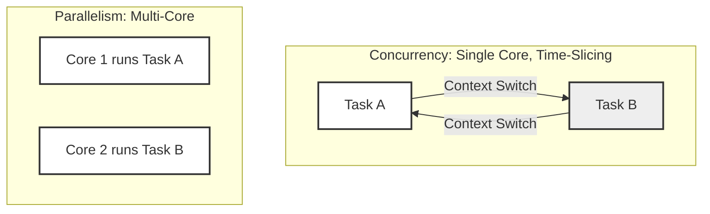
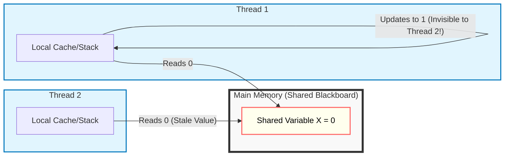
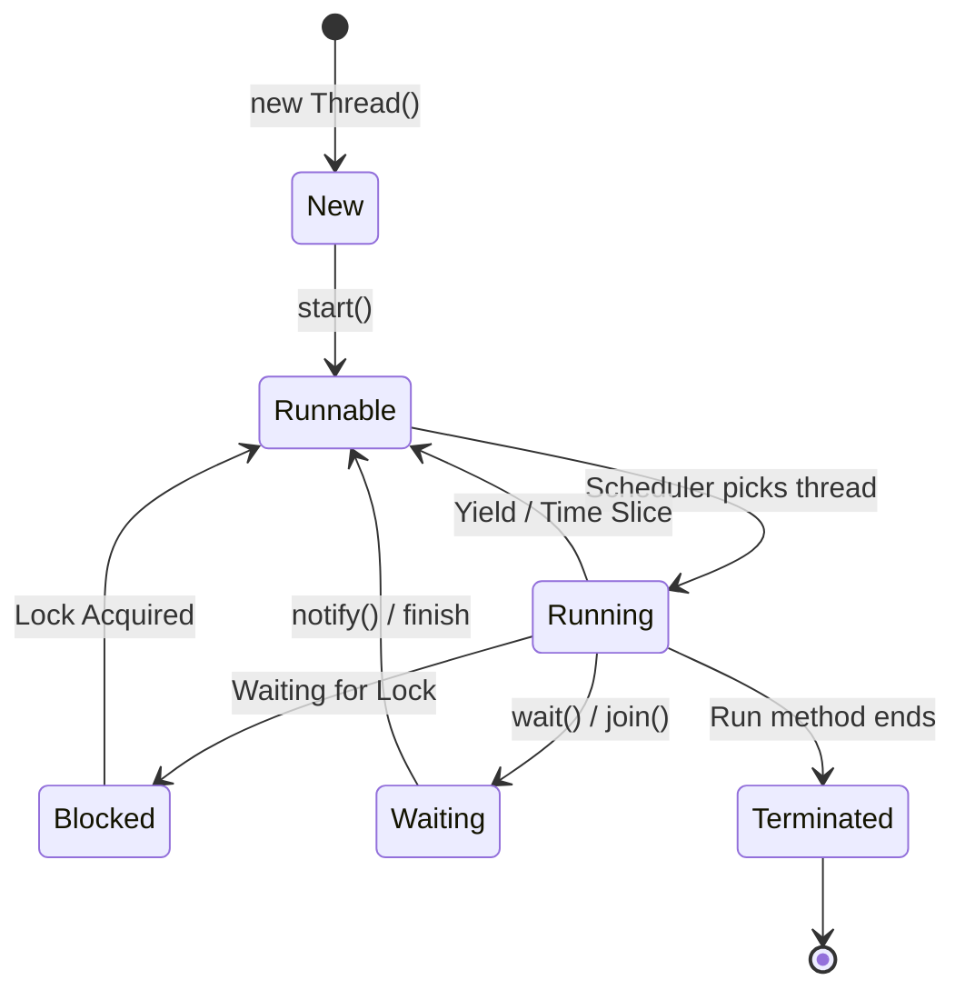
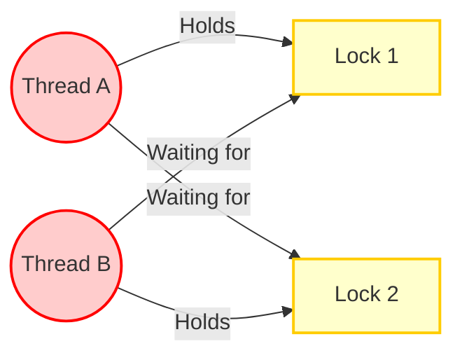
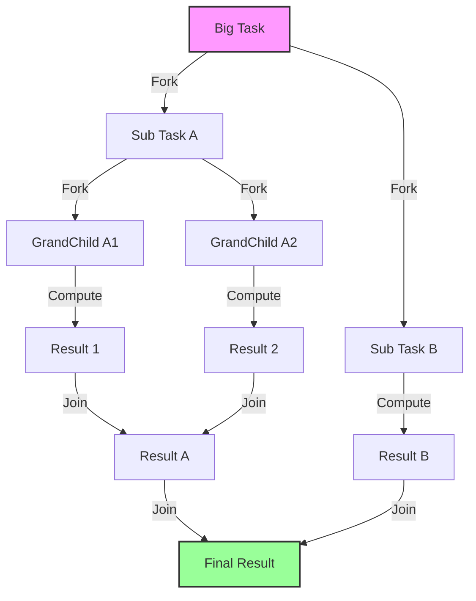

# Java Concurrency Masterclass
*A 2-Day Beginner-Friendly Course*

## Course Overview
Welcome to the Java Concurrency Masterclass. This course is designed to take you from the basics of threading to modern asynchronous programming with **Java 24**.

> [!TIP]
> **Interactive Labs:** This course includes a set of "Broken" code examples for you to fix. Open [JAVA_CONCURRENCY_LABS.md](JAVA_CONCURRENCY_LABS.md) to follow along!


### Prerequisites
- Basic knowledge of Java syntax and OOP.
- Java 24 (or at least Java 21) installed.

---

## Module 1: Fundamentals and Core Concepts

In this first module, we lay the foundation. Before writing code, we must understand *how* Java handles multiple tasks and memory.

### 1.1 Why do we need Concurrency?
There are two primary reasons we use threads:

1.  **Responsiveness (Don't freeze the app):**
    *   *Scenario:* A user clicks "Download". If you run this on the main thread, the button stays pressed and the mouse freezes until the download finishes.
    *   *Solution:* Run the download in a *background thread*. The UI stays clickable.
2.  **Performance (Use all CPUs):**
    *   *Scenario:* You have a 16-core CPU, but your image processing script only uses 1 core. The other 15 are idle (6% utilization).
    *   *Solution:* Split the image into 16 parts and process them in *parallel*.

### 1.2 Concurrency vs. Parallelism
It is crucial to distinguish between these two often confused terms.

- **Concurrency** is about *dealing* with strictly multiple things at once (structure). It's like a single juggler handling multiple balls.
- **Parallelism** is about *doing* multiple things at once (execution). It's like two jugglers each juggling a ball.



### 1.3 Synchronous vs. Asynchronous Programming
- **Synchronous (Blocking):** You call a function, and you wait until it returns.
  - *Example:* Ordering coffee and standing at the counter until it's served.
- **Asynchronous (Non-Blocking):** You call a function, get a "receipt" (Future), and do other work while the task runs.
  - *Example:* Ordering coffee, taking a buzzer, and sitting down to check emails until the buzzer rings.

### 1.4 Processes vs. Threads
Before understanding *how* threads communicate (JMM), we must define *what* they are.

- **Process:** An instance of a running program (e.g., the JVM).
  - *Analogy:* **A Factory.**
  - **Characteristics:** Isolated. Has its own building (memory space) and security. Using two factories requires shipping trucks (IPC) to talk.
- **Thread:** A path of execution *within* a process.
  - *Analogy:* **Workers** inside the Factory.
  - **Characteristics:** Lightweight. They share the factory floor (Heap Memory). They can easily pass tools to each other.

**Why is this important?**
Because workers (Threads) share the same space, they can step on each other's toes or fight over tools. This shared access leads to the complexity of the Java Memory Model.

### 1.5 The Java Memory Model (JMM)
This is often the hardest part for beginners. Java threads communicate by sharing memory, but they also have their own local cache (working memory).

#### The "Shared Blackboard" Analogy
Imagine a classroom:
1.  **Main Memory (Heap):** The big blackboard at the front of the room.
2.  **Thread Local Memory (Stack/Cache):** Each student (Thread) has a small notepad on their desk.

**The Problem:**
If Student A writes "X = 5" on their notepad, Student B looking at the blackboard still sees "X = 0". Student A must *flush* their change to the blackboard (Visibility) for Student B to see it.



> [!WARNING]
> **Visibility Issue:** Without proper synchronization (like `volatile` or `synchronized`), updates made by one thread may **never** be seen by others.

#### Key Concept: Atomicity
A simple line like `counter++` is **NOT** atomic. It is actually three steps:
1.  **Read** `counter` from memory.
2.  **Add** 1 to the value.
3.  **Write** the new value back.

If two threads do this at the same time, they might both read "5", both add 1, and both write "6", losing one update (Race Condition). We will see how to fix this in Module 2.

---

## Module 2: Basic Thread Management & Safety

Now that we know *how* memory works, we will start creating threads and ensure they work safely together.

### 2.1 The `Runnable` Interface
The most basic unit of work in Java is the `Runnable`. It represents a task that does not return a result. 

```java
// Main.java
public class Main {
    public static void main(String[] args) {
        // 1. Defining the task
        Runnable task = () -> {
            String threadName = Thread.currentThread().getName();
            System.out.println("Hello from " + threadName);
        };

        // 2. Creating the thread (The Worker)
        Thread thread = new Thread(task);

        // 3. Starting the thread
        thread.start(); 

        System.out.println("Hello from " + Thread.currentThread().getName());
    }
}
```
> [!NOTE]
> **Always call `start()` not `run()`!**
> Calling `run()` executes the code on the *current* thread (main), just like a normal method call. `start()` tells the OS to create a new separate thread of execution.

### 2.2 The Thread Lifecycle
Once a thread is started, it goes through several states. Understanding this is key to debugging.



- **New:** Created but not started.
- **Runnable:** Ready to run (waiting for CPU time).
- **Running:** Actively executing code.
- **Blocked/Waiting:** Paused (waiting for a lock or a signal).
- **Terminated:** Finished execution.

### 2.2a Thread Interruption (Stopping a Thread)
A common question: "How do I stop a thread?"
**Answer:** You ask it politely. You cannot *force* kill a thread (unsafe). You must `interrupt()` it, and the thread must check for this signal.

```java
Runnable task = () -> {
    while (!Thread.currentThread().isInterrupted()) {
        try {
            System.out.println("Working...");
            Thread.sleep(1000); 
        } catch (InterruptedException e) {
            System.out.println("I was told to stop!");
            // Important: Re-interrupt the thread locally if you need to propagate the state
            Thread.currentThread().interrupt(); 
            break; // Exit the loop
        }
    }
};
Thread thread = new Thread(task);
thread.start();
// Later...
thread.interrupt(); // Sends the signal
```

### 2.3 Blocking vs. Locking (The Difference)
Beginners often confuse these two terms. They both make a thread "wait", but for different reasons.

| Feature | **Blocking (I/O)** | **Locking (Synchronization)** |
| :--- | :--- | :--- |
| **Reason** | Waiting for an external resource (Network, Disk). | Waiting for permission to access shared memory. |
| **Analogy** | **Ordering Pizza:** You call (request) and wait on the line until they answer. You can't start eating until it arrives. | **Fitting Room:** You want to try clothes, but the door is locked. You wait until the person inside comes out. |
| **Code Example** | `db.executeQuery("SELECT *")` or `socket.read()` | `synchronized(this) { count++ }` |
| **CPU State** | CPU is idle (thread is swapped out). | CPU is idle (thread is blocked by OS). |

### 2.4 The Race Condition (The "Lost Update" Bug)
This is the most common concurrency bug. Let's demonstrate it with a shared counter.

```java
class Counter {
    private int count = 0;

    public void increment() {
        count++; // Not atomic! (Read -> Add -> Write)
    }

    public int getCount() { return count; }
}
```
If we run this with 2 threads each incrementing 1,000 times, we expect 2,000. But we often get 1,998 or 1,500.

**Why?**
Both threads read `count = 10` at the same time. Both add 1. Both write `11`. We lost one increment.

### 2.5 Synchronizing Access (The Lock)
To fix race conditions, we must ensure **Mutual Exclusion**. Only one thread can enter the critical section at a time.

#### Solution 1: The `synchronized` Keyword
This is the easiest way. It uses the object's intrinsic lock (monitor).

```java
public synchronized void increment() {
    count++;
}
```
Now, if Thread A is inside `increment()`, Thread B blocks (waits) until A finishes.

#### Solution 2: Explicit Locks (`ReentrantLock`)
For more control (like trying to lock but giving up after a timeout), use `ReentrantLock`.

```java
import java.util.concurrent.locks.ReentrantLock;

private final ReentrantLock lock = new ReentrantLock();

public void increment() {
    lock.lock();
    try {
        count++;
    } finally {
        lock.unlock(); // Always unlock in finally!
    }
}
```

### 2.6 Low-Level Synchronization (wait/notify)
Before `java.util.concurrent`, we used `wait()` and `notify()`. You might see this in legacy code or low-level library design.

**The Concept:**
- `wait()`: Release the lock and go to sleep until someone wakes me up.
- `notify()`: Wake up *one* thread waiting on this object.
- `notifyAll()`: Wake up *all* threads waiting on this object.

**Analogy (Pizza Store):**
- **Bad Approach (Polling):** Customer asks "Is pizza ready?" every second. (CPU Waste).
- **Good Approach (Wait/Notify):** Customer waits. Chef rings a bell (`notify`) when ready.

```java
Object lock = new Object();
boolean pizzaReady = false;

// Thread 1: The Waiter
synchronized(lock) {
    while(!pizzaReady) { // Always check condition in a loop!
        lock.wait(); // Releases lock and sleeps
    }
    // Wake up and eat!
}

// Thread 2: The Chef
synchronized(lock) {
    pizzaReady = true;
    lock.notifyAll(); // Wakes up the Waiter
}
```

### 2.7 Choosing the Right Lock (Advanced)
Not all locks are created equal. Choose the right tool for the job.

| Lock Type | Use Case | Analogy |
| :--- | :--- | :--- |
| **`synchronized`** | **General Purpose.** Simple, exclusive access. Used for critical sections like counter updates. | **Airplane Bathroom.** Only one person enters. Simple "Occupied" sign. |
| **`ReentrantLock`** | **Advanced Control.** Need fairness (first-come-first-serve) or "tryLock" (give up after waiting). | **Hotel Card Key.** You can try to enter, but if it fails, you can walk away (unlike `synchronized` where you are stuck waiting). |
| **`ReadWriteLock`** | **Read-Heavy Caches.** Many threads read, few write. Allowing multiple readers boosts performance. | **TV Screen.** Millions of people can *watch* (Read) at the same time. But if the station needs to fix the screen (Write), everyone stops watching. |
| **`StampedLock`** | **Ultra-High Performance.** Optimistic locking. Complex but fast. | **Taking a Screenshot.** You try to snap a picture. If the scene changes *while* you click, you discard it and try again. |

### 2.8 Liveness Issues (Deadlock, Starvation, Livelock)
A deadlock happens when two threads are waiting for each other forever. But there are other ways threads can get stuck.

#### 1. Deadlock
The classic "I have A, need B" vs "I have B, need A".

#### 2. Starvation
A thread never gets CPU time because other "greedy" (high priority) threads keep taking it.
*   **Analogy:** A polite person at a busy 4-way stop who keeps letting others go first. They never cross the intersection.

#### 3. Livelock
Threads are active (CPU is working), but making no progress. They are practically stuck.
*   **Analogy:** Two people meeting in a hallway. Both step left. Both step right. Both step left again. They are moving, but stuck.

**Scenario:**
- Thread A holds **Lock 1** and wants **Lock 2**.
- Thread B holds **Lock 2** and wants **Lock 1**.



> [!TIP]
> **Prevention:** Always acquire locks in the **same order** (e.g., always Lock 1 then Lock 2) to avoid cycles.

### 2.9 Thread Safety without Locks
Locks (`synchronized`) are heavy. Sometimes we can do better.

#### The `volatile` Keyword
If a variable is capable of being updated by multiple threads, but the update doesn't depend on the current value (like a flag), use `volatile`.
`volatile` guarantees **Visibility** (flush to main memory) but **NOT Atomicity**.

```java
private volatile boolean running = true;

public void stop() { running = false; }
public void work() { while (running) { /* do work */ } }
```

#### Atomic Classes
For simple counters, use `AtomicInteger`. It uses hardware-level CAS (Compare-And-Swap) instructions which are much faster than locks.

```java
import java.util.concurrent.atomic.AtomicInteger;

AtomicInteger atomicCount = new AtomicInteger(0);
atomicCount.incrementAndGet(); // Atomic + Visible!
```

### 2.10 ThreadLocal (Per-Thread Data)
Sometimes you want a variable that is **NOT** shared. Each thread should have its own copy.

**Use Case:** User Sessions, Database Transactions, or non-thread-safe objects like `SimpleDateFormat` (legacy).

```java
// Each thread gets its own unique ID
ThreadLocal<Integer> threadId = ThreadLocal.withInitial(() -> (int) (Math.random() * 1000));

new Thread(() -> {
    System.out.println(threadId.get()); // Prints e.g., 101
}).start();

new Thread(() -> {
    System.out.println(threadId.get()); // Prints e.g., 555 (Different!)
}).start();
```

> [!WARNING]
> **Memory Leak Risk:** In thread pools (like Tomcat), threads live forever. If you don't call `threadId.remove()`, the data stays in memory forever!

---

## Module 3: Concurrency Building Blocks & Patterns

Managing raw threads (`new Thread()`) is expensive and error-prone. Java provides higher-level abstractions.

### 3.1 The Executor Framework
Instead of creating a thread per task, we use an `ExecutorService` which manages a **Pool** of threads.

```java
import java.util.concurrent.ExecutorService;
import java.util.concurrent.Executors;

// 1. Create a pool with 2 reusable threads
ExecutorService executor = Executors.newFixedThreadPool(2);

// 2. Submit tasks
for (int i = 0; i < 5; i++) {
    int taskId = i;
    executor.submit(() -> {
        System.out.println("Task " + taskId + " running on " + Thread.currentThread().getName());
    });
}

// 3. Shutdown the pool (Important!)
executor.shutdown(); 
```

### 3.1a Scheduled Execution
Sometimes you need to run a task periodically (e.g., "Check for new emails every minute"). Do NOT use `Thread.sleep()` in a `while` loop!

Use `ScheduledExecutorService`.

```java
import java.util.concurrent.ScheduledExecutorService;
import java.util.concurrent.Executors;
import java.util.concurrent.TimeUnit;

ScheduledExecutorService scheduler = Executors.newScheduledThreadPool(1);

// Run task every 5 seconds, with an initial delay of 1 second
scheduler.scheduleAtFixedRate(
    () -> System.out.println("Checking email..."),
    1, 5, TimeUnit.SECONDS
);
```

### 3.2 Returning Values: Callable & Future
What if we want our thread to return a value? `Runnable` return type is `void`. For results, we use `Callable<v>`.

```java
import java.util.concurrent.Callable;

Callable<Integer> calculation = () -> {
    Thread.sleep(1000);
    return 42;
};
// Note: You can't pass a Callable directly to `new Thread()`. 
// We will run this using Executors below.
```

When you submit a `Callable` to an executor, you get a `Future`. It's a placeholder for a result that isn't ready yet.

```java
import java.util.concurrent.ExecutorService;
import java.util.concurrent.Executors;
import java.util.concurrent.Future;

ExecutorService executor = Executors.newSingleThreadExecutor();

Future<Integer> future = executor.submit(() -> {
    Thread.sleep(1000);
    return 42;
});

// Do other work...

try {
    // This BLOCKS until the result is ready
    Integer result = future.get(); 
    System.out.println("Result: " + result);
} catch (Exception e) {
    e.printStackTrace();
} finally {
    executor.shutdown();
}
```

### 3.3 Concurrent Collections
Never use `ArrayList` or `HashMap` in a multi-threaded request without locking!
- **Bad:** `HashMap` (Not thread safe, can cause infinite loops).
- **Better:** `Collections.synchronizedMap(new HashMap<>())` (Safe, but slow - coarse locking).
- **Best:** `ConcurrentHashMap` (Safe and fast - lock stripping).

```java
Map<String, Integer> map = new ConcurrentHashMap<>();
map.put("Key", 1); // Thread-safe
```

### 3.4 Design Pattern Lab: Producer-Consumer
The "Hello World" of concurrency patterns. Steps:
1.  **Producer** generates data.
2.  **Consumer** processes data.
3.  **BlockingQueue** acts as the buffer (handles all synchronization for us!).

```java
import java.util.concurrent.BlockingQueue;
import java.util.concurrent.LinkedBlockingQueue;

public class ProducerConsumer {
    public static void main(String[] args) {
        BlockingQueue<String> queue = new LinkedBlockingQueue<>(10); // Cap of 10

        // Producer
        new Thread(() -> {
            try {
                while(true) {
                    String item = "Item " + System.nanoTime();
                    queue.put(item); // Blocks if full
                    System.out.println("Produced: " + item);
                    Thread.sleep(100);
                }
            } catch (InterruptedException e) { Thread.currentThread().interrupt(); }
        }).start();

        // Consumer
        new Thread(() -> {
            try {
                while(true) {
                    String item = "Item " + queue.take(); // Blocks if empty
                    System.out.println("Consumed: " + item);
                    Thread.sleep(200);
                }
            } catch (InterruptedException e) { Thread.currentThread().interrupt(); }
        }).start();
    }
}
```

---

### 3.5 The Fork/Join Framework
For tasks that can be broken down recursively (Divide and Conquer), the **Fork/Join Framework** is more efficient than a standard `ExecutorService`.

#### Concept: Work Stealing
Standard pools have a single queue. Fork/Join has a queue **per thread**.
- **Analogy (The Library):**
    - You have 10,000 books to sort.
    - You split the pile between 4 librarians.
    - If Librarian A finishes early, they **steal** a pile from Librarian B's queue to help out. **No one sits idle!**



#### Code Example: Recursive Task
Lets sum a massive array by splitting it.

```java
import java.util.concurrent.RecursiveTask;
import java.util.concurrent.ForkJoinPool;

public class SumTask extends RecursiveTask<Long> {
    private final long[] numbers;
    private final int start, end;
    private static final int THRESHOLD = 10_000; // Workload size

    public SumTask(long[] numbers, int start, int end) {
        this.numbers = numbers;
        this.start = start;
        this.end = end;
    }

    @Override
    protected Long compute() {
        if (end - start <= THRESHOLD) {
            // Base Case: Compute directly
            long sum = 0;
            for (int i = start; i < end; i++) sum += numbers[i];
            return sum;
        } else {
            // Recursive Case: Split (Fork)
            int mid = start + (end - start) / 2;
            SumTask left = new SumTask(numbers, start, mid);
            SumTask right = new SumTask(numbers, mid, end);
            
            left.fork(); // Async execution
            long rightResult = right.compute(); // Compute helpful work on this thread!
            long leftResult = left.join(); // Wait for result
            
            return leftResult + rightResult;
        }
    }
}
```

---

## Module 4: Modern Asynchronous Programming

`Future` (from Module 3) has a problem: `get()` blocks the thread.
**CompletableFuture** allows us to build **Non-Blocking Pipelines**.

### 4.1 Creating Async Tasks
Use `supplyAsync` for tasks that return a result.

```java
import java.util.concurrent.CompletableFuture;

CompletableFuture.supplyAsync(() -> {
    // This runs in the ForkJoinPool.commonPool() by default
    return "Hello";
})
.thenApply(s -> s + " World") // Transform Data
.thenAccept(System.out::println); // Consume Data
```

### 4.2 Chaining & Composing
- **thenApply:** `map()` (Transform T -> R)
- **thenCompose:** `flatMap()` (Chain one async task after another)

```java
CompletableFuture<User> getUser(int id) { ... }
CompletableFuture<Order> getOrders(User user) { ... }

// Wrong: Returns CompletableFuture<CompletableFuture<Order>>
/* getUser(1).thenApply(user -> getOrders(user)); */

// Correct: Flattens the result
getUser(1).thenCompose(user -> getOrders(user));
```

### 4.3 Combining Multiple Tasks
Run tasks in parallel and wait for all (or any).

```java
CompletableFuture<String> api1 = CompletableFuture.supplyAsync(() -> "Data 1");
CompletableFuture<String> api2 = CompletableFuture.supplyAsync(() -> "Data 2");

CompletableFuture<Void> all = CompletableFuture.allOf(api1, api2);

all.thenRun(() -> {
    // Both are done!
    System.out.println("Done!");
});
```

### 4.4 Error Handling & Timeouts (Java 24+ Friendly)
Production code needs robust error handling.

```java
CompletableFuture.supplyAsync(() -> {
    if (true) throw new RuntimeException("API Failed!");
    return "Success";
})
.exceptionally(ex -> {
    System.out.println("Recovering from: " + ex.getMessage());
    return "Default Value";
})
.orTimeout(1, TimeUnit.SECONDS) // Creating a TimeoutException if too slow
.thenAccept(System.out::println);
```

### 4.5 Controlling the Executor
By default, `CompletableFuture` uses a shared pool. In production (e.g., Spring Boot), **ALWAYS** pass your own Executor.

```java
ExecutorService myPool = Executors.newFixedThreadPool(10);

CompletableFuture.supplyAsync(() -> {
    return "Heavy Task";
}, myPool); // explicit executor
```

---

## Module 5: Advanced Topics & Best Practices

In this final module, we look at performance, testing, and the future of Java concurrency.

### 5.1 Performance: I/O vs. CPU Bound
- **CPU Bound (Calculations):** Use a thread pool size close to the number of CPU cores.
  - *Formula:* `N_threads = N_cpu + 1`
- **I/O Bound (DB calls, HTTP):** Threads spend most time waiting. You need *more* threads.
  - *Goal:* Keep the CPU busy while others wait.

### 5.2 Testing Concurrency
Testing threaded code is hard because bugs are non-deterministic.
- **Tools:** Use **JCStress** for low-level lock testing.
- **Unit Tests:** Use `CountDownLatch` or `Awaitility` to wait for async operations.

```java
@Test
public void testAsync() throws InterruptedException {
    CountDownLatch latch = new CountDownLatch(1);
    
    CompletableFuture.runAsync(() -> {
        // ... logic
        latch.countDown();
    });

    latch.await(1, TimeUnit.SECONDS); // Wait for async task
}
```

### 5.3 Virtual Threads (Java 21 / 24+)
This is the biggest change in Java history.
**Platform Threads (Old):** 1 Java Thread = 1 OS Thread (Heavy, ~2MB RAM).
**Virtual Threads (New):** 1000s of Virtual Threads = 1 OS Thread (Light, ~bytes).

#### The New Paradigm: "One Thread Per Task"
You no longer need complex Reactive chains (Module 4) just to save threads. You can write simple, blocking code again!

```java
// Java 21+ code
try (var executor = Executors.newVirtualThreadPerTaskExecutor()) {
    // Submit 10,000 tasks!
    for (int i = 0; i < 10_000; i++) {
        executor.submit(() -> {
            Thread.sleep(100); // Blocking is cheap now!
            return "Done";
        });
    }
} // Auto-close waits for all tasks
```

> [!IMPORTANT]
> **When to use Virtual Threads:** High-throughput I/O servers (Web Servers, Database calls).
> **When NOT to use:** CPU-heavy tasks (Image processing).

## Conclusion
You have journeyed from basic `Runnables` to modern `Virtual Threads`.
1.  **Understand** JMM and Shared State.
2.  **Protect** Critical Sections with Locks or Atomic Variables.
3.  **Scale** with `ExecutorService` and `CompletableFuture`.
4.  **Simplify** high-concurrency I/O with **Virtual Threads**.

**End of Course**
