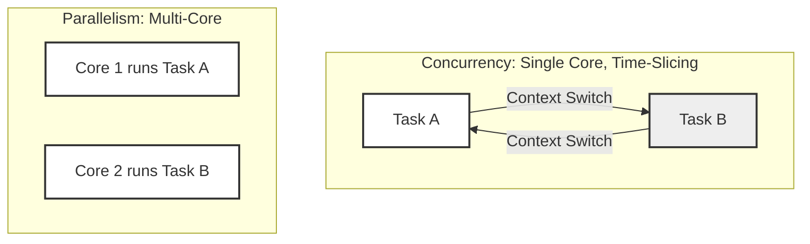
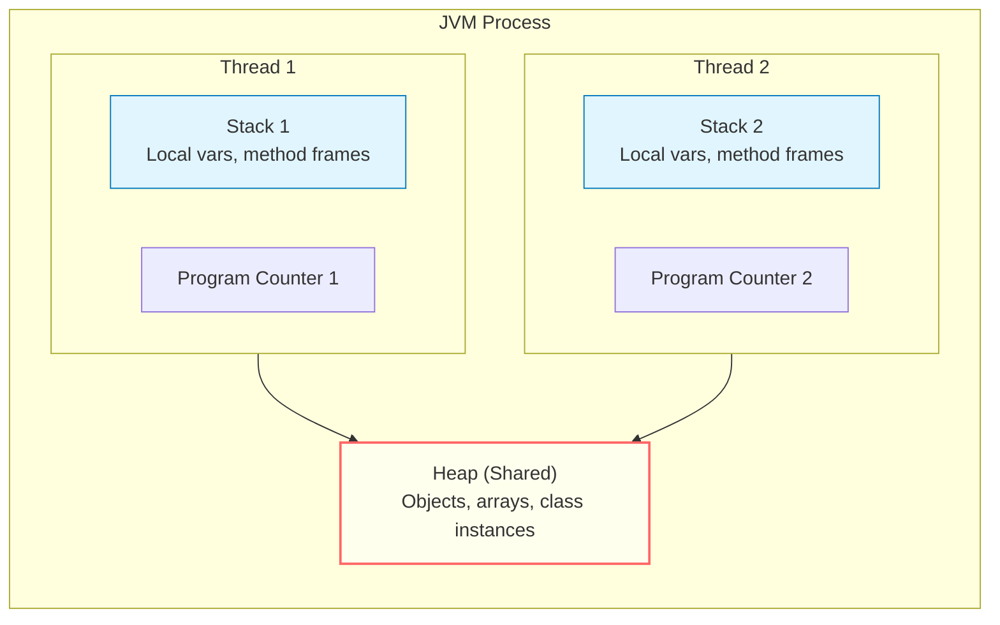
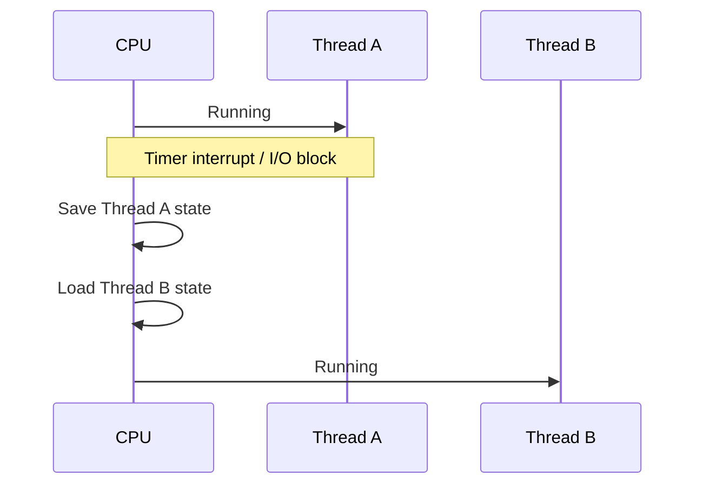
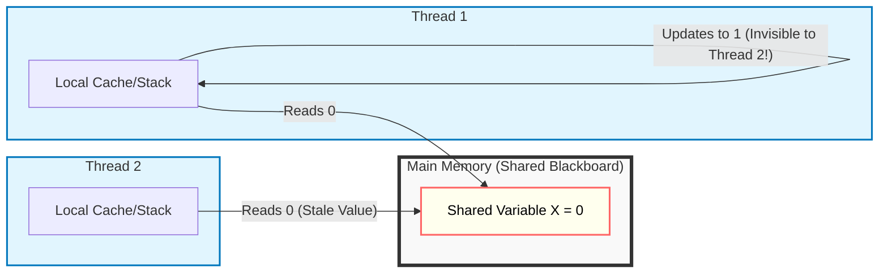
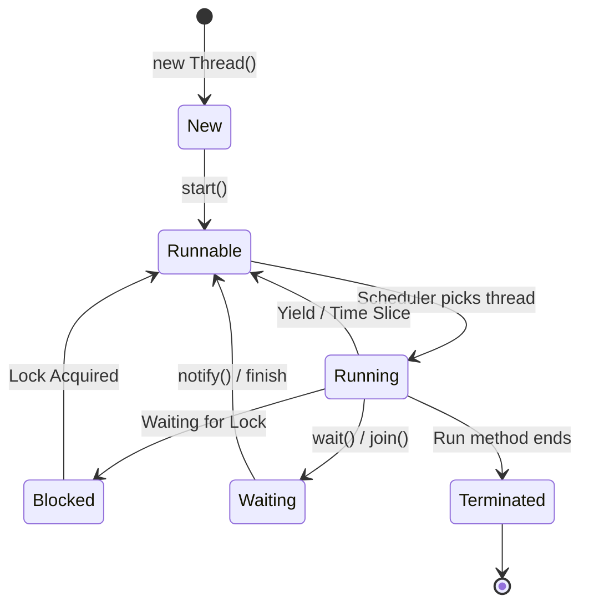
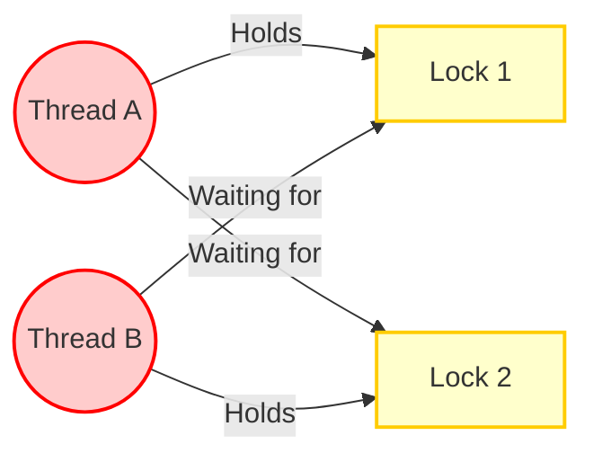
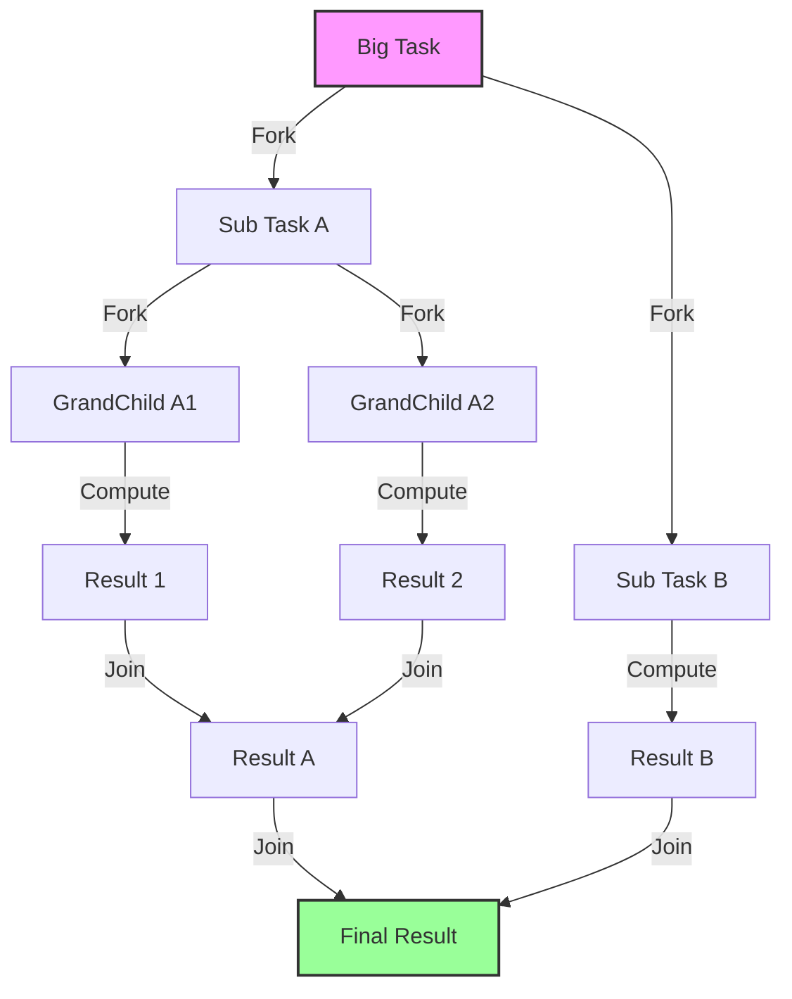
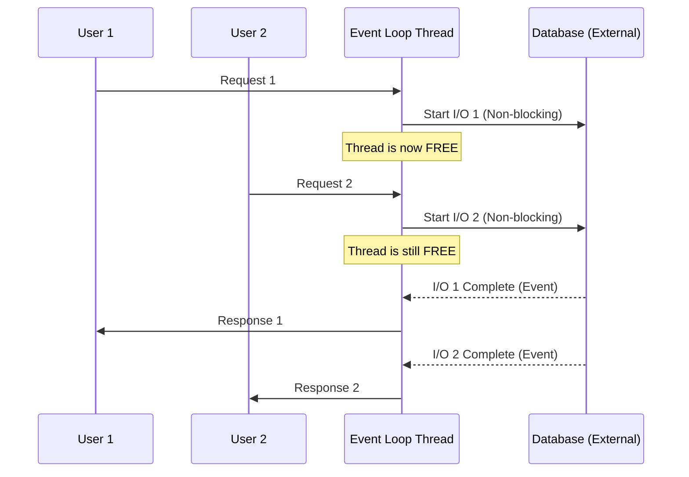

# Java Concurrency Masterclass
*A 2-Day Beginner-Friendly Course*

## Course Overview
Welcome to the Java Concurrency Masterclass. This course is designed to take you from the basics of threading to modern asynchronous programming with **Java 21+**.

> [!TIP]
> **Interactive Labs:** This course includes a set of "Broken" code examples for you to fix. Open [JAVA_CONCURRENCY_LABS.md](JAVA_CONCURRENCY_LABS.md) to follow along!


### Prerequisites
- Basic knowledge of Java syntax and OOP.
- Java 21+ installed.

---

## Module 1: Fundamentals and Core Concepts

In this first module, we lay the foundation. Before writing code, we must understand *how* Java handles multiple tasks and memory.

### 1.1 Why do we need Concurrency?
There are two primary reasons we use threads:

1.  **Responsiveness (Don't freeze the app):**
    *   *Scenario:* A user clicks "Download". If you run this on the main thread, the button stays pressed and the mouse freezes until the download finishes.
    *   *Solution:* Run the download in a *background thread*. The UI stays clickable.
2.  **Performance (Use all CPUs):**
    *   *Scenario:* You have a 16-core CPU, but your image processing script only uses 1 core. The other 15 are idle (6% utilization).
    *   *Solution:* Split the image into 16 parts and process them in *parallel*.

### 1.2 Concurrency vs. Parallelism
It is crucial to distinguish between these two often confused terms.

- **Concurrency** is about *dealing* with strictly multiple things at once (structure). It's like a single juggler handling multiple balls.
- **Parallelism** is about *doing* multiple things at once (execution). It's like two jugglers each juggling a ball.



### 1.3 Synchronous vs. Asynchronous Programming
- **Synchronous (Blocking):** You call a function, and you wait until it returns.
  - *Example:* Ordering coffee and standing at the counter until it's served.
- **Asynchronous (Non-Blocking):** You call a function, get a "receipt" (Future), and do other work while the task runs.
  - *Example:* Ordering coffee, taking a buzzer, and sitting down to check emails until the buzzer rings.

### 1.4 From Program to Process
Before diving into threads, let's understand what happens when you run a Java program:

1.  You write your code (`.java` file).
2.  The compiler turns it into bytecode (`.class` file).
3.  The JVM loads the bytecode into **memory**.
4.  The OS allocates resources and the program becomes a **running process**.
5.  Threads are created *within* that process to execute the bytecode.

Every running process gets a set of essential resources from the OS:

| Resource | What It Does |
| :--- | :--- |
| **Registers** | Small, fast storage holding data the CPU is actively working with (current values, addresses). |
| **Program Counter** | Tracks *where* the CPU is in the instruction sequence ("which line am I on?"). |
| **Stack** | Per-thread scratch space for method calls, local variables, and return addresses. |
| **Heap** | Shared memory pool for objects allocated with `new`. All threads in a process share this. |

> [!TIP]
> You can see your running processes in **Task Manager** (Windows: `Ctrl+Shift+Esc`) or **Activity Monitor** (macOS). Try it now — look for `java` or `javaw` processes. You can see how many threads each process is using, its CPU %, and memory consumption. This is a valuable tool for debugging performance issues and unresponsive applications.

### 1.5 Processes vs. Threads
Now that we know what a process is, let's define *what* threads are.

- **Process:** An instance of a running program (e.g., the JVM).
  - *Analogy:* **A Factory.**
  - **Characteristics:** Isolated. Has its own building (memory space) and security. Using two factories requires shipping trucks (IPC) to talk.
- **Thread:** A path of execution *within* a process.
  - *Analogy:* **Workers** inside the Factory.
  - **Characteristics:** Lightweight. They share the factory floor (Heap Memory). They can easily pass tools to each other.

#### Stack vs. Heap: What Threads Share (and Don't)
This is a **critical** distinction:
- Each thread gets its **own Stack** (local variables, method calls — private to that thread).
- All threads in a process **share the Heap** (objects created with `new`).



This is why concurrency bugs happen: **the Heap is shared**, so two threads can read/write the same object simultaneously. The Stack is safe because it's private.

**Why is this important?**
Because workers (Threads) share the same space, they can step on each other's toes or fight over tools. This shared access leads to the complexity of the Java Memory Model.

#### Multiprocessing vs. Multithreading

| Feature | **Multiprocessing** | **Multithreading** |
| :--- | :--- | :--- |
| **Memory** | Separate memory per process | Shared memory within process |
| **Crash Scope** | One process crash doesn't affect others | One thread crash may crash the entire process |
| **Communication** | Needs IPC (pipes, sockets) | Easier (shared memory) |
| **Overhead** | Higher (new memory space per process) | Lower (threads share heap) |
| **Best For** | CPU-intensive, isolated tasks | I/O-bound or lightweight concurrent tasks |

#### Real-World Example: Google Chrome's Architecture
When Google designed Chrome, they chose to run **each browser tab as a separate process** instead of threads. Why?

- **Crash isolation:** If one tab crashes (e.g., a bad JavaScript page), other tabs keep working. You just close that tab.
- **Security:** A malicious website in one process cannot access memory of another tab.
- **OS memory management:** Inactive tabs (processes) can be swapped to disk by the OS when memory is low.

**The trade-off:** Starting a new process per tab costs more memory than a thread. But Google bet that crash isolation and security were worth it — and they were right.

> [!NOTE]
> In Java, we almost always work with **threads within a single JVM process**. But this Chrome example helps you understand *when* separate processes are the better choice.

### 1.6 Context Switching
When the CPU switches from one task (thread or process) to another, it performs a **context switch**. This involves:
1.  **Saving** the current task's state (registers, stack pointer, program counter).
2.  **Loading** the next task's saved state.
3.  **Resuming** execution of the next task.

*Analogy:* It's like switching between tabs in a browser with lots of unsaved forms — each switch takes time and focus to restore where you left off.

> [!NOTE]
> Context switches are **not free**. They cost CPU cycles and can flush CPU caches, which is why creating too many threads can actually *hurt* performance. This is one reason we use **Thread Pools** (Module 3) instead of creating a new thread per task.



### 1.7 The Java Memory Model (JMM)
This is often the hardest part for beginners. Java threads communicate by sharing memory, but they also have their own local cache (working memory).

#### The "Shared Blackboard" Analogy
Imagine a classroom:
1.  **Main Memory (Heap):** The big blackboard at the front of the room.
2.  **Thread Local Memory (Stack/Cache):** Each student (Thread) has a small notepad on their desk.

**The Problem:**
If Student A writes "X = 5" on their notepad, Student B looking at the blackboard still sees "X = 0". Student A must *flush* their change to the blackboard (Visibility) for Student B to see it.



> [!WARNING]
> **Visibility Issue:** Without proper synchronization (like `volatile` or `synchronized`), updates made by one thread may **never** be seen by others.

#### Key Concept: Atomicity
A simple line like `counter++` is **NOT** atomic. It is actually three steps:
1.  **Read** `counter` from memory.
2.  **Add** 1 to the value.
3.  **Write** the new value back.

If two threads do this at the same time, they might both read "5", both add 1, and both write "6", losing one update (Race Condition). We will see how to fix this in Module 2.

---

## Module 2: Basic Thread Management & Safety

Now that we know *how* memory works, we will start creating threads and ensure they work safely together.

### 2.1 The `Runnable` Interface
The most basic unit of work in Java is the `Runnable`. It represents a task that does not return a result. 

```java
// Main.java
public class Main {
    public static void main(String[] args) {
        // 1. Defining the task
        Runnable task = () -> {
            String threadName = Thread.currentThread().getName();
            System.out.println("Hello from " + threadName);
        };

        // 2. Creating the thread (The Worker)
        Thread thread = new Thread(task);

        // 3. Starting the thread
        thread.start(); 

        System.out.println("Hello from " + Thread.currentThread().getName());
    }
}
```
> [!NOTE]
> **Always call `start()` not `run()`!**
> Calling `run()` executes the code on the *current* thread (main), just like a normal method call. `start()` tells the OS to create a new separate thread of execution.

### 2.2 The Thread Lifecycle
Once a thread is started, it goes through several states. Understanding this is key to debugging.



- **New:** Created but not started.
- **Runnable:** Ready to run (waiting for CPU time).
- **Running:** Actively executing code.
- **Blocked:** Waiting to acquire a monitor lock (to enter a `synchronized` block).
- **Waiting:** Paused indefinitely for another thread to perform a specific action (signal).
- **Timed Waiting:** Paused for a specified waiting time (e.g., `Thread.sleep(ms)`).
- **Terminated:** Finished execution.

### 2.2a Thread Interruption (Stopping a Thread)
A common question: "How do I stop a thread?"
**Answer:** You ask it politely. You cannot *force* kill a thread (unsafe). You must `interrupt()` it, and the thread must check for this signal.

```java
Runnable task = () -> {
    while (!Thread.currentThread().isInterrupted()) {
        try {
            System.out.println("Working...");
            Thread.sleep(1000); 
        } catch (InterruptedException e) {
            System.out.println("I was told to stop!");
            // Important: Re-interrupt the thread locally if you need to propagate the state
            Thread.currentThread().interrupt(); 
            break; // Exit the loop
        }
    }
};
Thread thread = new Thread(task);
thread.start();
// Later...
thread.interrupt(); // Sends the signal
```

### 2.3 Blocked vs. Waiting vs. Sleeping
Beginners often confuse these terms. They all make a thread "wait", but for different reasons.

| Feature | **Blocked** | **Waiting** | **Timed Waiting (Sleeping)** |
| :--- | :--- | :--- | :--- |
| **Reason** | Waiting for an **Intrinsic Lock** (Monitor). | Waiting for a **Signal** from another thread. | Waiting for a **Clock** (Time to pass). |
| **Analogy** | **Fitting Room:** Door is locked from inside. You wait outside. | **Coffee Shop:** You've ordered and are waiting for your name to be called. | **Alarm Clock:** You are taking a nap for exactly 20 minutes. |
| **Trigger** | Trying to enter `synchronized`. | `object.wait()`, `thread.join()`. | `Thread.sleep(ms)`. |
| **Transition** | Automatically moves to Runnable when lock is free. | Needs another thread to call `notify()` or `notifyAll()`. | Automatically moves to Runnable when time is up. |
| **CPU State** | Suspended by OS. | Suspended by OS. | Suspended by OS. |

### 2.4 The Race Condition (The "Lost Update" Bug)
This is the most common concurrency bug. Let's demonstrate it with a shared counter.

```java
// RaceConditionDemo.java — Run this multiple times to see different results!
public class RaceConditionDemo {
    private int count = 0;

    public void increment() {
        count++; // Not atomic! (Read -> Add -> Write)
    }

    public int getCount() { return count; }

    public static void main(String[] args) throws InterruptedException {
        RaceConditionDemo counter = new RaceConditionDemo();

        Thread t1 = new Thread(() -> {
            for (int i = 0; i < 1_000; i++) counter.increment();
        });
        Thread t2 = new Thread(() -> {
            for (int i = 0; i < 1_000; i++) counter.increment();
        });

        t1.start();
        t2.start();
        t1.join(); // Wait for t1 to finish
        t2.join(); // Wait for t2 to finish

        System.out.println("Expected: 2000");
        System.out.println("Actual:   " + counter.getCount());
    }
}
```

**Try it:** Run this multiple times. You expect `2000`, but you'll often get results like `1998`, `1847`, or `1500`.

**Why?**
Both threads read `count = 10` at the same time. Both add 1. Both write `11`. We lost one increment.

### 2.5 Synchronizing Access (The Lock)
To fix race conditions, we must ensure **Mutual Exclusion**. Only one thread can enter the critical section at a time. Java provides two ways to do this.

#### Solution 1: The `synchronized` Keyword
Every Java object has a built-in lock called an **intrinsic lock** (or **monitor**). When you mark a method or block as `synchronized`, Java automatically:
1.  **Acquires** the lock before entering the method.
2.  **Releases** the lock when the method exits (even if an exception is thrown).

Only one thread can hold the lock at a time. Any other thread trying to enter a `synchronized` method on the same object will **wait** until the lock is released.

```java
public synchronized void increment() {
    count++;
}
```
Now, if Thread A is inside `increment()`, Thread B blocks (waits) until A finishes.

#### Solution 2: Explicit Locks (`ReentrantLock`)
`synchronized` is simple but limited — you can't interrupt a thread waiting for a lock, you can't try to acquire a lock with a timeout, and you can't use fairness policies.

`ReentrantLock` gives you **explicit control** over locking. The word "reentrant" means the same thread can acquire the lock multiple times without deadlocking itself (it just increments a hold count).

```java
import java.util.concurrent.locks.ReentrantLock;

private final ReentrantLock lock = new ReentrantLock();

public void increment() {
    lock.lock();
    try {
        count++;
    } finally {
        lock.unlock(); // Always unlock in finally!
    }
}
```

### 2.6 Low-Level Synchronization (wait/notify)
Before `java.util.concurrent`, we used `wait()` and `notify()`. You might see this in legacy code or low-level library design.

**The Concept:**
- `wait()`: Release the lock and go to sleep until someone wakes me up.
- `notify()`: Wake up *one* thread waiting on this object.
- `notifyAll()`: Wake up *all* threads waiting on this object.

**Analogy (Pizza Store):**
- **Bad Approach (Polling):** Customer asks "Is pizza ready?" every second. (CPU Waste).
- **Good Approach (Wait/Notify):** Customer waits. Chef rings a bell (`notify`) when ready.

```java
Object lock = new Object();
boolean pizzaReady = false;

// Thread 1: The Waiter
synchronized(lock) {
    while(!pizzaReady) { // Always check condition in a loop!
        // wait() puts the thread in the WAITING state and RELEASES the lock
        lock.wait(); 
    }
    // Wake up (transition back to Runnable -> Running) and eat!
}

// Thread 2: The Chef
synchronized(lock) {
    pizzaReady = true;
    lock.notifyAll(); // Wakes up the Waiter
}
```

### 2.6a Real-World Software Examples
While low-level, `wait` and `notify` are the "atoms" used to build high-level concurrency tools.

1.  **Bounded Buffers (Flow Control)**: 
    *   *Usage:* Preventing a fast producer from overwhelming a slow consumer.
    *   *Logic:* If the buffer is full, the producer calls `wait()`. When the consumer takes an item, it calls `notify()` to wake the producer up.
2.  **Thread Pools (Idle Management)**: 
    *   *Usage:* Keeping worker threads alive without burning CPU cycles.
    *   *Logic:* Worker threads run in a loop. If the task queue is empty, they call `wait()`. When you `submit()` a task, the pool calls `notifyAll()` to wake a worker.
3.  **Database Connection Pools**: 
    *   *Usage:* Managing a limited set of expensive resources.
    *   *Logic:* If no connections are available, the requesting thread calls `wait()`. When another thread returns a connection, it calls `notify()` to signal availability.
4.  **Service Initialization (Guarded Suspension)**: 
    *   *Usage:* Waiting for a background dependency (like a Config Loader) to finish.
    *   *Logic:* The main thread calls `wait()` until the loader thread sets an `isReady` flag and calls `notify()`.

---

### 2.7 Choosing the Right Lock (Advanced)
Not all locks are created equal. Choose the right tool for the job.

| Lock Type | Use Case | Analogy |
| :--- | :--- | :--- |
| **`synchronized`** | **General Purpose.** Simple, exclusive access. Used for critical sections like counter updates. | **Airplane Bathroom.** Only one person enters. Simple "Occupied" sign. |
| **`ReentrantLock`** | **Advanced Control.** Need fairness (first-come-first-serve) or "tryLock" (give up after waiting). | **Hotel Card Key.** You can try to enter, but if it fails, you can walk away (unlike `synchronized` where you are stuck waiting). |
| **`ReadWriteLock`** | **Read-Heavy Caches.** Many threads read, few write. Allowing multiple readers boosts performance. | **TV Screen.** Millions of people can *watch* (Read) at the same time. But if the station needs to fix the screen (Write), everyone stops watching. |
| **`StampedLock`** | **Ultra-High Performance.** Optimistic locking. Complex but fast. | **Taking a Screenshot.** You try to snap a picture. If the scene changes *while* you click, you discard it and try again. |

### 2.8 Liveness Issues (Deadlock, Starvation, Livelock)
A deadlock happens when two threads are waiting for each other forever. But there are other ways threads can get stuck.

#### 1. Deadlock
The classic "I have A, need B" vs "I have B, need A".

#### 2. Starvation
A thread never gets CPU time because other "greedy" (high priority) threads keep taking it.
*   **Analogy:** A polite person at a busy 4-way stop who keeps letting others go first. They never cross the intersection.

#### 3. Livelock
Threads are active (CPU is working), but making no progress. They are practically stuck.
*   **Analogy:** Two people meeting in a hallway. Both step left. Both step right. Both step left again. They are moving, but stuck.

**Scenario:**
- Thread A holds **Lock 1** and wants **Lock 2**.
- Thread B holds **Lock 2** and wants **Lock 1**.



> [!TIP]
> **Prevention:** Always acquire locks in the **same order** (e.g., always Lock 1 then Lock 2) to avoid cycles.

### 2.9 Thread Safety without Locks
Locks (`synchronized`) are heavy. Sometimes we can do better.

#### The `volatile` Keyword
If a variable is capable of being updated by multiple threads, but the update doesn't depend on the current value (like a flag), use `volatile`.
`volatile` guarantees **Visibility** (flush to main memory) but **NOT Atomicity**.

```java
private volatile boolean running = true;

public void stop() { running = false; }
public void work() { while (running) { /* do work */ } }
```

#### Atomic Classes
For simple counters, use `AtomicInteger`. It uses hardware-level CAS (Compare-And-Swap) instructions which are much faster than locks.

```java
import java.util.concurrent.atomic.AtomicInteger;

AtomicInteger atomicCount = new AtomicInteger(0);
atomicCount.incrementAndGet(); // Atomic + Visible!
```

### 2.10 ThreadLocal (Per-Thread Data)
Sometimes you want a variable that is **NOT** shared. Each thread should have its own copy.

**Use Case:** User Sessions, Database Transactions, or non-thread-safe objects like `SimpleDateFormat` (legacy).

```java
// Each thread gets its own unique ID
ThreadLocal<Integer> threadId = ThreadLocal.withInitial(() -> (int) (Math.random() * 1000));

new Thread(() -> {
    System.out.println(threadId.get()); // Prints e.g., 101
}).start();

new Thread(() -> {
    System.out.println(threadId.get()); // Prints e.g., 555 (Different!)
}).start();
```

> [!WARNING]
> **Memory Leak Risk:** In thread pools (like Tomcat), threads live forever. If you don't call `threadId.remove()`, the data stays in memory forever!

---

## Module 3: Concurrency Building Blocks & Patterns

Managing raw threads (`new Thread()`) is expensive and error-prone. Java provides higher-level abstractions.

### 3.1 The Executor Framework
Instead of creating a thread per task, we use an `ExecutorService` which manages a **Pool** of threads.

```java
import java.util.concurrent.ExecutorService;
import java.util.concurrent.Executors;

// 1. Create a pool with 2 reusable threads
ExecutorService executor = Executors.newFixedThreadPool(2);

// 2. Submit tasks
for (int i = 0; i < 5; i++) {
    int taskId = i;
    executor.submit(() -> {
        System.out.println("Task " + taskId + " running on " + Thread.currentThread().getName());
    });
}

// 3. Shutdown the pool (Important!)
executor.shutdown(); 
```

### 3.1a Scheduled Execution
Sometimes you need to run a task periodically (e.g., "Check for new emails every minute"). Do NOT use `Thread.sleep()` in a `while` loop!

Use `ScheduledExecutorService`.

```java
import java.util.concurrent.ScheduledExecutorService;
import java.util.concurrent.Executors;
import java.util.concurrent.TimeUnit;

ScheduledExecutorService scheduler = Executors.newScheduledThreadPool(1);

// Run task every 5 seconds, with an initial delay of 1 second
scheduler.scheduleAtFixedRate(
    () -> System.out.println("Checking email..."),
    1, 5, TimeUnit.SECONDS
);
```

### 3.2 Returning Values: Callable & Future
What if we want our thread to return a value? `Runnable` return type is `void`. For results, we use `Callable<v>`.

```java
import java.util.concurrent.Callable;

Callable<Integer> calculation = () -> {
    Thread.sleep(1000);
    return 42;
};
// Note: You can't pass a Callable directly to `new Thread()`. 
// We will run this using Executors below.
```

When you submit a `Callable` to an executor, you get a `Future`. It's a placeholder for a result that isn't ready yet.

```java
import java.util.concurrent.ExecutorService;
import java.util.concurrent.Executors;
import java.util.concurrent.Future;

ExecutorService executor = Executors.newSingleThreadExecutor();

Future<Integer> future = executor.submit(() -> {
    Thread.sleep(1000);
    return 42;
});

// Do other work...

try {
    // This BLOCKS until the result is ready
    Integer result = future.get(); 
    System.out.println("Result: " + result);
} catch (Exception e) {
    e.printStackTrace();
} finally {
    executor.shutdown();
}
```

### 3.3 Concurrent Collections
Never use `ArrayList` or `HashMap` in a multi-threaded environment without external synchronization.

#### 1. The `HashMap` Issue
`HashMap` is not thread-safe. When multiple threads modify a `HashMap` simultaneously, several things can go wrong:
- **Data Loss:** Two threads trying to put different keys at the same hash bucket might overwrite each other.
- **Corrupt Internal State:** The `size` count can become inaccurate.
- **Infinite Loops (Legacy):** In older Java versions (pre-Java 8), concurrent resizing could cause a circular dependency in the underlying linked list, leading to 100% CPU usage.

**Example: HashMap failing in a multi-threaded environment**
```java
import java.util.HashMap;
import java.util.Map;
import java.util.concurrent.ExecutorService;
import java.util.concurrent.Executors;
import java.util.concurrent.TimeUnit;

public class HashMapIssueDemo {
    public static void main(String[] args) throws InterruptedException {
        Map<String, Integer> map = new HashMap<>(); // Standard HashMap
        int numberOfThreads = 2;
        int incrementsPerThread = 5000;

        ExecutorService executor = Executors.newFixedThreadPool(numberOfThreads);

        for (int i = 0; i < numberOfThreads; i++) {
            executor.submit(() -> {
                for (int j = 0; j < incrementsPerThread; j++) {
                    // Two threads trying to put 10,000 unique keys
                    map.put(Thread.currentThread().getName() + "-" + j, j);
                }
            });
        }

        executor.shutdown();
        executor.awaitTermination(1, TimeUnit.MINUTES);

        System.out.println("Expected size: " + (numberOfThreads * incrementsPerThread));
        System.out.println("Actual size:   " + map.size());
    }
}
```
*Note: Run this multiple times. You will likely see the "Actual size" is less than 10,000 because of race conditions during `put()` operations.*

#### 2. The `ConcurrentHashMap` Solution
`ConcurrentHashMap` is designed for high concurrency. Instead of locking the entire map (like `Hashtable` or `Collections.synchronizedMap`), it uses **Lock Stripping**. It divides the map into segments and only locks the specific segment being modified.

**Example: ConcurrentHashMap solving the issue**
```java
import java.util.Map;
import java.util.concurrent.ConcurrentHashMap;
import java.util.concurrent.ExecutorService;
import java.util.concurrent.Executors;
import java.util.concurrent.TimeUnit;

public class ConcurrentHashMapSolution {
    public static void main(String[] args) throws InterruptedException {
        Map<String, Integer> map = new ConcurrentHashMap<>(); // Thread-safe!
        int numberOfThreads = 2;
        int incrementsPerThread = 5000;

        ExecutorService executor = Executors.newFixedThreadPool(numberOfThreads);

        for (int i = 0; i < numberOfThreads; i++) {
            executor.submit(() -> {
                for (int j = 0; j < incrementsPerThread; j++) {
                    map.put(Thread.currentThread().getName() + "-" + j, j);
                }
            });
        }

        executor.shutdown();
        executor.awaitTermination(1, TimeUnit.MINUTES);

        System.out.println("Expected size: " + (numberOfThreads * incrementsPerThread));
        System.out.println("Actual size:   " + map.size());
    }
}
```
*Result: This will consistently print 10,000 because ConcurrentHashMap handles the internal synchronization correctly.*

#### Comparison: Thread-Safe Maps

| Feature | `HashMap` | `SynchronizedMap` | `ConcurrentHashMap` |
| :--- | :--- | :--- | :--- |
| **Thread-Safe** | No | Yes | Yes |
| **Locking Strategy** | None | Whole Object Lock (Slow) | Lock Stripping (Fast) |
| **Performance** | Fastest (Single-thread) | Slowest (Concurrency Bottleneck) | Optimized for Multi-threading |
| **Compound Ops** | Unsafe | Needs external sync | Provided (e.g., `putIfAbsent`) |

#### Deep Dive: Whole Object Lock vs. Lock Stripping

**Whole Object Lock** (e.g., `Hashtable`, `Collections.synchronizedMap`):
- **Mechanism:** One single "monitor" lock for the entire map instance.
- **Analogy:** A **Single-Occupancy Building**. No matter which room you want to visit, you need the front door key. If Thread A is reading from room 1, Thread B must wait at the front door just to read from room 20.
- **Impact:** high contention. Even read-only operations block each other.

**Lock Stripping** (e.g., `ConcurrentHashMap`):
- **Mechanism:** The map is divided into many independent buckets (segments). Each bucket has its own lock.
- **Analogy:** A **Hotel with many rooms**. You only need the key for the specific room you are entering. Thread A can modify Room 1 while Thread B simultaneously modifies Room 5.
- **Impact:** High throughput. Multiple threads can read and write to different parts of the map at the same time without any waiting.

#### 3. Thread-Safe Lists: `CopyOnWriteArrayList`
Just as `HashMap` is not thread-safe, `ArrayList` is also prone to issues (like `ConcurrentModificationException`) when accessed by multiple threads.

While `Collections.synchronizedList` exists, the concurrent replacement is **`CopyOnWriteArrayList`**.

**How it works:**
- **Analogy:** A **Snapshot System**. Every time you want to *modify* (add/remove) the list, it creates a brand new copy of the entire underlying array.
- **Why?** This ensures that any thread currently *reading* the list sees a consistent, immutable snapshot. Reads never block!
- **Trade-off:**
    - **Pros:** Ultra-fast reads. Perfect for "Read-Heavy" scenarios (e.g., a list of listeners or configuration settings).
    - **Cons:** Very expensive writes. If the list is large or you modify it frequently, the performance will crawl due to constant array copying.

**Example: ArrayList failing with ConcurrentModificationException (Multi-threaded)**
```java
import java.util.ArrayList;
import java.util.List;

public class ArrayListIssueDemo {
    public static void main(String[] args) {
        List<String> list = new ArrayList<>();
        list.add("Item 1");
        list.add("Item 2");
        list.add("Item 3");

        // Thread 1: Reader - Iterating through the list
        new Thread(() -> {
            try {
                for (String item : list) {
                    System.out.println("Reading: " + item);
                    Thread.sleep(50); // Give writer time to strike
                }
            } catch (Exception e) {
                System.out.println("READER CAUGHT: " + e);
            }
        }).start();

        // Thread 2: Writer - Modifying the list simultaneously
        new Thread(() -> {
            try {
                Thread.sleep(20);
                list.add("Item 4"); // CRASH! The reader is iterating
                System.out.println("Writer added Item 4");
            } catch (Exception e) {
                System.out.println("WRITER CAUGHT: " + e);
            }
        }).start();
    }
}
```
*Note: The Reader will throw `ConcurrentModificationException` because the Writer modified the structure while iteration was in progress.*

**Example: CopyOnWriteArrayList solving the issue (Multi-threaded)**
```java
import java.util.List;
import java.util.concurrent.CopyOnWriteArrayList;

public class CopyOnWriteArrayListSolution {
    public static void main(String[] args) {
        List<String> list = new CopyOnWriteArrayList<>();
        list.add("Item 1");
        list.add("Item 2");
        list.add("Item 3");

        // Thread 1: Reader - Safe because it uses a Snapshot of the array
        new Thread(() -> {
            try {
                for (String item : list) {
                    System.out.println("Reading: " + item);
                    Thread.sleep(50); 
                }
            } catch (Exception e) {
                System.out.println("READER CAUGHT: " + e);
            }
        }).start();

        // Thread 2: Writer - Creates a NEW copy of the array. Reader is unaffected.
        new Thread(() -> {
            try {
                Thread.sleep(20);
                list.add("Item 4");
                System.out.println("Writer added Item 4");
            } catch (Exception e) {
                System.out.println("WRITER CAUGHT: " + e);
            }
        }).start();
    }
}
```
*Result: Both threads finish successfully. The Reader continues with its snapshot, and the Writer's change will be visible to any NEW iteration started after the modification.*

### 3.4 Design Pattern Lab: Producer-Consumer
The "Hello World" of concurrency patterns. Steps:
1.  **Producer** generates data.
2.  **Consumer** processes data.
3.  **BlockingQueue** acts as the buffer (handles all synchronization for us!).

```java
import java.util.concurrent.BlockingQueue;
import java.util.concurrent.LinkedBlockingQueue;

public class ProducerConsumer {
    public static void main(String[] args) {
        BlockingQueue<String> queue = new LinkedBlockingQueue<>(10); // Cap of 10

        // Producer
        new Thread(() -> {
            try {
                while(true) {
                    String item = "Item " + System.nanoTime();
                    queue.put(item); // Blocks if full
                    System.out.println("Produced: " + item);
                    Thread.sleep(100);
                }
            } catch (InterruptedException e) { Thread.currentThread().interrupt(); }
        }).start();

        // Consumer
        new Thread(() -> {
            try {
                while(true) {
                    String item = "Item " + queue.take(); // Blocks if empty
                    System.out.println("Consumed: " + item);
                    Thread.sleep(200);
                }
            } catch (InterruptedException e) { Thread.currentThread().interrupt(); }
        }).start();
    }
}
```

---

### 3.5 The Fork/Join Framework
For tasks that can be broken down recursively (Divide and Conquer), the **Fork/Join Framework** is more efficient than a standard `ExecutorService`.

#### Concept: Work Stealing
Standard pools have a single queue. Fork/Join has a queue **per thread**.
- **Analogy (The Library):**
    - You have 10,000 books to sort.
    - You split the pile between 4 librarians.
    - If Librarian A finishes early, they **steal** a pile from Librarian B's queue to help out. **No one sits idle!**



#### Code Example: Recursive Task
Lets sum a massive array by splitting it.

```java
import java.util.concurrent.RecursiveTask;
import java.util.concurrent.ForkJoinPool;

public class SumTask extends RecursiveTask<Long> {
    private final long[] numbers;
    private final int start, end;
    private static final int THRESHOLD = 10_000; // Workload size

    public SumTask(long[] numbers, int start, int end) {
        this.numbers = numbers;
        this.start = start;
        this.end = end;
    }

    @Override
    protected Long compute() {
        if (end - start <= THRESHOLD) {
            // Base Case: Compute directly
            long sum = 0;
            for (int i = start; i < end; i++) sum += numbers[i];
            return sum;
        } else {
            // Recursive Case: Split (Fork)
            int mid = start + (end - start) / 2;
            SumTask left = new SumTask(numbers, start, mid);
            SumTask right = new SumTask(numbers, mid, end);
            
            left.fork(); // Async execution
            long rightResult = right.compute(); // Compute helpful work on this thread!
            long leftResult = left.join(); // Wait for result
            
            return leftResult + rightResult;
        }
    }

    public static void main(String[] args) {
        long[] numbers = new long[100_000];
        for (int i = 0; i < numbers.length; i++) numbers[i] = i;

        ForkJoinPool pool = new ForkJoinPool();
        SumTask task = new SumTask(numbers, 0, numbers.length);

        long result = pool.invoke(task); // Start the task
        System.out.println("Final Sum: " + result);
    }
}
```

#### Understanding the `SumTask` Logic

The logic follows a standard **Divide and Conquer** pattern to maximize CPU usage:

1.  **The Base Case (THRESHOLD):**
    We don't want to split tasks forever. Creating a new task has overhead. If the workload is small enough (controlled by `THRESHOLD`), it's faster to just sum it in a simple `for` loop than to bother splitting it again.
2.  **The Recursive Case (Split):**
    If the workload is too big, we find the middle point and create two new `SumTask` objects. One handles the left half of the array, the other handles the right.
3.  **Fork & Join (Parallelism):**
    - `left.fork()`: Tells the pool to put this task in the queue. Other idle threads can now "steal" this work.
    - `right.compute()`: The **current thread** immediately starts working on the right half. This is a crucial optimization—maintaining the current thread's productivity!
    - `left.join()`: Finally, the thread waits for the left task to finish and retrieves its result.
4.  **Result:** Combine `leftResult + rightResult` and return.

> [!NOTE]
> On a modern 8-core CPU, a normal loop uses only one core. `SumTask` allows the `ForkJoinPool` to spread the work across all available cores, ensuring no CPU power goes to waste.

---

## Module 4: Modern Asynchronous Programming

`Future` (from Module 3) has a problem: `get()` blocks the thread.
**CompletableFuture** allows us to build **Non-Blocking Pipelines**.

### 4.1 Creating Async Tasks
Use `supplyAsync` for tasks that return a result. In modern Java, `HttpClient` integrates perfectly with `CompletableFuture`.

```java
import java.net.URI;
import java.net.http.HttpClient;
import java.net.http.HttpRequest;
import java.net.http.HttpResponse;
import java.util.concurrent.CompletableFuture;

HttpClient client = HttpClient.newHttpClient();
HttpRequest request = HttpRequest.newBuilder()
        .uri(URI.create("https://httpbin.org/get"))
        .build();

// supplyAsync is implicit here as sendAsync returns a CompletableFuture
client.sendAsync(request, HttpResponse.BodyHandlers.ofString())
      .thenApply(HttpResponse::body)
      .thenAccept(System.out::println);
```

### 4.2 Chaining & Composing (Sequential Flow)
- **thenApply:** `map()` (Transform result T -> R).
- **thenCompose:** `flatMap()` (Run a second async task using the result of the first).

**Example: Fetch a Secure Token, then fetch User Data**
```java
CompletableFuture<String> tokenFuture = client.sendAsync(
    HttpRequest.newBuilder().uri(URI.create("https://httpbin.org/uuid")).build(),
    HttpResponse.BodyHandlers.ofString()
).thenApply(HttpResponse::body);

// Chaining: Use the UUID/Token to make a second call
CompletableFuture<String> result = tokenFuture.thenCompose(token -> {
    return client.sendAsync(
        HttpRequest.newBuilder().uri(URI.create("https://httpbin.org/headers"))
                   .header("X-Auth-Token", token).build(),
        HttpResponse.BodyHandlers.ofString()
    ).thenApply(HttpResponse::body);
});

result.thenAccept(System.out::println);
```

### 4.3 Combining Multiple Tasks (Parallel Flow)
Run multiple independent tasks in parallel and wait for all of them to complete.

```java
CompletableFuture<String> call1 = client.sendAsync(
    HttpRequest.newBuilder().uri(URI.create("https://httpbin.org/ip")).build(),
    HttpResponse.BodyHandlers.ofString()
).thenApply(HttpResponse::body);

CompletableFuture<String> call2 = client.sendAsync(
    HttpRequest.newBuilder().uri(URI.create("https://httpbin.org/user-agent")).build(),
    HttpResponse.BodyHandlers.ofString()
).thenApply(HttpResponse::body);

// Combine: wait for both
CompletableFuture.allOf(call1, call2)
    .thenRun(() -> {
        try {
            System.out.println("Combined Results:");
            System.out.println("IP: " + call1.get());
            System.out.println("User-Agent: " + call2.get());
        } catch (Exception e) { e.printStackTrace(); }
    });
```

### 4.4 Error Handling & Timeouts (Java 21+ Friendly)
Production code needs robust error handling.

```java
CompletableFuture.supplyAsync(() -> {
    if (true) throw new RuntimeException("API Failed!");
    return "Success";
})
.exceptionally(ex -> {
    System.out.println("Recovering from: " + ex.getMessage());
    return "Default Value";
})
.orTimeout(1, TimeUnit.SECONDS) // Creating a TimeoutException if too slow
.thenAccept(System.out::println);
```

### 4.5 Controlling the Executor
By default, `CompletableFuture` uses a shared pool. In production (e.g., Spring Boot), **ALWAYS** pass your own Executor.

```java
ExecutorService myPool = Executors.newFixedThreadPool(10);

CompletableFuture.supplyAsync(() -> {
    return "Heavy Task";
}, myPool); // explicit executor
```

---

## Module 5: Advanced Topics & Best Practices

In this final module, we look at performance, testing, and the future of Java concurrency.

### 5.1 Performance: I/O vs. CPU Bound
- **CPU Bound (Calculations):** Use a thread pool size close to the number of CPU cores.
  - *Formula:* `N_threads = N_cpu + 1`
- **I/O Bound (DB calls, HTTP):** Threads spend most time waiting. You need *more* threads.
  - *Goal:* Keep the CPU busy while others wait.

#### Hyper-Threading / SMT
Modern CPUs often support **Simultaneous Multithreading (SMT)**, also known as **Hyper-Threading** (Intel's term). Each physical core can handle **2 logical threads** concurrently by sharing execution resources.

- A **4-core CPU with SMT** reports **8 logical processors** to the OS.
- `Runtime.getRuntime().availableProcessors()` returns the **logical** count (e.g., 8), not physical cores (4).
- For **CPU-bound** work, using more threads than *physical* cores gives diminishing returns since the logical threads still compete for the same ALU/FPU.
- For **I/O-bound** work, the extra logical threads help keep the core busy while one thread is waiting.

### 5.2 Testing Concurrency
Testing threaded code is hard because bugs are non-deterministic.
- **Tools:** Use **JCStress** for low-level lock testing.
- **Unit Tests:** Use `CountDownLatch` or `Awaitility` to wait for async operations.
- **Deep Dive:** [Async Testing with Awaitility](file:///c:/dev/work/java-concurrency-course/ASYNC_TESTING_MASTERCLASS.md)

```java
@Test
public void testAsync() throws InterruptedException {
    CountDownLatch latch = new CountDownLatch(1);
    
    CompletableFuture.runAsync(() -> {
        // ... logic
        latch.countDown();
    });

```java
    latch.await(1, TimeUnit.SECONDS); // Wait for async task
}
```

### 5.3 The Event Loop Model & Reactive Programming
Before Java 21 brought us Virtual Threads, the industry shifted toward **Reactive Programming** to solve the scalability limits of traditional platform threads.

#### The Problem: Thread-per-Request Bottleneck
In a traditional Servlet-based application (like standard Spring Boot with Tomcat), each incoming request is assigned a dedicated thread. 
- If that thread calls a database that takes 2 seconds to respond, the thread stays **Blocked,** doing nothing but consuming 1MB of RAM.
- To handle 10,000 concurrent users, you’d need 10GB of RAM just for thread stacks!

#### The Solution: The Event Loop Evolution
Frameworks like **Spring WebFlux (Project Reactor)** and **Vert.x** adopted the **Event Loop** model, popularized by Node.js. 

**Mechanics of the Event Loop:**
1.  **Single/Few Threads:** A very small number of threads (often equal to CPU cores) handles all traffic.
2.  **Non-Blocking I/O:** When a request needs to wait for I/O (e.g., calling a DB), it doesn't wait. It registers a "callback" (an event listener) and the thread immediately moves to the next user.
3.  **The Callback:** When the DB responds, the event loop picks up that event and finishes the task.

#### Visualizing the Event Loop



**Comparison: Thread-per-Request vs. Event Loop**

```text
Thread-per-Request (Servlet)         Event Loop (WebFlux/Node)
----------------------------         -------------------------
[User 1] --> [Thread A] (Waiting...) [User 1] \
[User 2] --> [Thread B] (Waiting...) [User 2] --> [One Thread] --> [OS/DB]
[User 3] --> [Thread C] (Waiting...) [User 3] /
(1000 users = 1000 threads)          (1000 users = 1 thread)
```

| Feature | Scaling Method | Mental Model | Best For |
| :--- | :--- | :--- | :--- |
| **Traditional Java** | Add more threads | Imperative (Simple) | General enterprise apps |
| **Reactive (WebFlux)** | Use Event Loops | Functional (Complex) | Reverse Proxies, Gateways |
| **Virtual Threads** | Lightweight threads | Imperative (Simple) | High-concurrency I/O |

#### Why use WebFlux or Vert.x today?
While **Virtual Threads** have made traditional blocking code scalable again, reactive frameworks are still relevant for:
- **Backpressure:** Managing the flow of data so a fast producer doesn't overwhelm a slow consumer.
- **Streaming:** Processing massive datasets or real-time event streams that don't have a fixed "end."
- **Legacy Reactive codebases:** Many high-performance systems are already built this way.

> [!IMPORTANT]
> **Reactive Programming** solved the scalability problem but introduced "Reactive Complexity." Developers had to learn a new way to write code using `Mono`, `Flux`, and functional chains. Virtual Threads aim to provide the same scalability with the simple code we already know.

## Conclusion
You have journeyed from basic `Runnables` to modern asynchronous programming.
1.  **Understand** JMM and Shared State.
2.  **Protect** Critical Sections with Locks or Atomic Variables.
3.  **Scale** with `ExecutorService` and `CompletableFuture`.


**End of Course**
